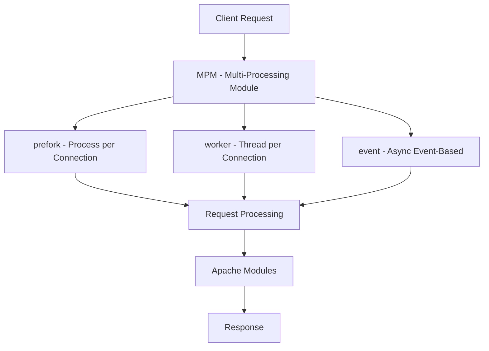
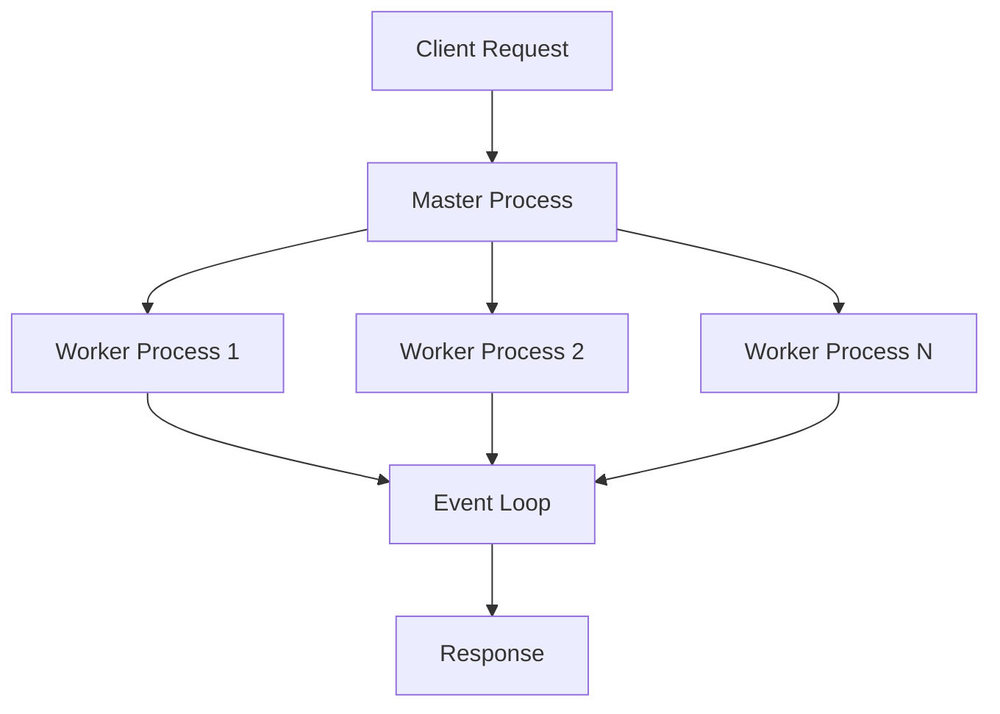

# Apache vs Nginx: Comprehensive Server Guide

## Apache HTTP Server (httpd)

### Architecture Overview


### Multi-Processing Modules (MPM)

1. **Prefork MPM (Traditional)**
```apache
# prefork MPM configuration
<IfModule mpm_prefork_module>
    StartServers             5
    MinSpareServers         5
    MaxSpareServers         10
    MaxRequestWorkers       150
    MaxConnectionsPerChild  0
</IfModule>
```
- Creates separate process for each connection
- Better compatibility with older modules
- Higher memory usage
- Good for PHP/mod_php

2. **Worker MPM (Threaded)**
```apache
# worker MPM configuration
<IfModule mpm_worker_module>
    StartServers             3
    MinSpareThreads         25
    MaxSpareThreads         75
    ThreadLimit             64
    ThreadsPerChild         25
    MaxRequestWorkers       400
    MaxConnectionsPerChild  0
</IfModule>
```
- Uses threads instead of processes
- More efficient memory usage
- Better concurrent handling

3. **Event MPM (Modern)**
```apache
# event MPM configuration
<IfModule mpm_event_module>
    StartServers             3
    MinSpareThreads         25
    MaxSpareThreads         75
    ThreadLimit             64
    ThreadsPerChild         25
    MaxRequestWorkers       400
    MaxConnectionsPerChild  0
    AsyncRequestWorkerFactor 2
</IfModule>
```
- Similar to Worker but handles keep-alive connections better
- Designed for high concurrency
- Most efficient MPM

### Module System
```apache
# Example of module loading
LoadModule rewrite_module modules/mod_rewrite.so
LoadModule ssl_module modules/mod_ssl.so
LoadModule php_module modules/libphp.so

# Module configuration
<IfModule mod_ssl.c>
    SSLEngine on
    SSLCertificateFile "/path/to/cert.pem"
    SSLCertificateKeyFile "/path/to/key.pem"
</IfModule>
```

### Virtual Hosts Configuration
```apache
<VirtualHost *:80>
    ServerName example.com
    DocumentRoot /var/www/html/example
    
    <Directory /var/www/html/example>
        Options Indexes FollowSymLinks
        AllowOverride All
        Require all granted
    </Directory>
    
    ErrorLog ${APACHE_LOG_DIR}/error.log
    CustomLog ${APACHE_LOG_DIR}/access.log combined
</VirtualHost>
```

## Nginx

### Architecture Overview


### Event-Driven Architecture
```nginx
# Main event loop configuration
events {
    worker_connections 1024;
    use epoll;  # Linux
    multi_accept on;
}

# Worker processes
worker_processes auto;
worker_rlimit_nofile 65535;
```

### Reverse Proxy Configuration
```nginx
# Load balancing example
upstream backend_servers {
    least_conn;  # Load balancing algorithm
    server backend1.example.com:8080;
    server backend2.example.com:8080;
    server backend3.example.com:8080;
    keepalive 32;
}

server {
    listen 80;
    server_name example.com;

    location /api/ {
        proxy_pass http://backend_servers;
        proxy_http_version 1.1;
        proxy_set_header Upgrade $http_upgrade;
        proxy_set_header Connection 'upgrade';
        proxy_set_header Host $host;
        proxy_cache_bypass $http_upgrade;
        
        # Timeouts
        proxy_connect_timeout 60s;
        proxy_send_timeout 60s;
        proxy_read_timeout 60s;
    }
}
```

### Caching Configuration
```nginx
# Cache configuration
http {
    proxy_cache_path /path/to/cache levels=1:2 keys_zone=my_cache:10m max_size=10g inactive=60m use_temp_path=off;

    server {
        location / {
            proxy_cache my_cache;
            proxy_cache_use_stale error timeout http_500 http_502 http_503 http_504;
            proxy_cache_valid 200 60m;
            proxy_cache_valid 404 1m;
        }
    }
}
```

## Key Differences

### 1. Request Processing
- **Apache**:
  - Process/Thread per connection (traditional)
  - Higher memory usage
  - Better for dynamic content processing
  
- **Nginx**:
  - Event-driven, asynchronous
  - Lower memory footprint
  - Better for static content and concurrent connections

### 2. Performance Characteristics

#### Apache
- Better for dynamic content
- More flexible with .htaccess
- Higher memory usage per connection
- Better module ecosystem

#### Nginx
- Excellent static file performance
- Superior concurrent connection handling
- Lower memory footprint
- Better reverse proxy capabilities

### 3. Common Use Cases

#### Apache Best Uses
- Dynamic content heavy sites
- Shared hosting environments
- Need for .htaccess flexibility
- Legacy application support

```apache
# .htaccess example
<IfModule mod_rewrite.c>
    RewriteEngine On
    RewriteBase /
    RewriteRule ^index\.php$ - [L]
    RewriteCond %{REQUEST_FILENAME} !-f
    RewriteCond %{REQUEST_FILENAME} !-d
    RewriteRule . /index.php [L]
</IfModule>
```

#### Nginx Best Uses
- Static content serving
- Reverse proxy/load balancer
- High-traffic websites
- Microservices architecture

```nginx
# Nginx optimal static file serving
server {
    listen 80;
    server_name static.example.com;
    
    location /static/ {
        root /var/www;
        expires 30d;
        add_header Cache-Control "public, no-transform";
        try_files $uri $uri/ =404;
    }
    
    location ~* \.(jpg|jpeg|png|gif|ico|css|js)$ {
        expires 30d;
        add_header Cache-Control "public, no-transform";
    }
}
```

## Best Practices

### Apache
1. Use Event MPM when possible
2. Minimize .htaccess usage
3. Configure proper worker counts
4. Enable module caching
5. Use appropriate process/thread limits

### Nginx
1. Configure worker processes correctly
2. Use upstream keepalive
3. Implement proper caching
4. Configure buffer sizes appropriately
5. Use microcaching for dynamic content

***This guide covers the main aspects of both servers. Both are excellent choices but excel in different scenarios. The choice between them often depends on specific use cases and requirements.***

#### Let me summarize the key differences and use cases for both servers:

**1.Apache HTTP Server:**

    - Process-based architecture with multiple MPMs (Prefork, Worker, Event)
    - Excellent for dynamic content and PHP applications
    - More flexible with per-directory configuration (.htaccess)
    - Better support for older applications
    - Larger module ecosystem


**2.Nginx:**

    - Event-driven architecture
    - Superior performance for static content
    - Excellent as a reverse proxy and load balancer
    - Better handling of concurrent connections
    - Lower memory footprint


**Common Combined Usage:**

    - Many organizations use both: Nginx as a front-end server/reverse proxy
    - Apache handling the backend dynamic content processing
    - This combines the strengths of both servers


