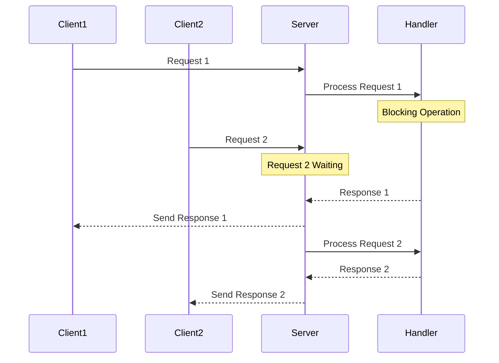
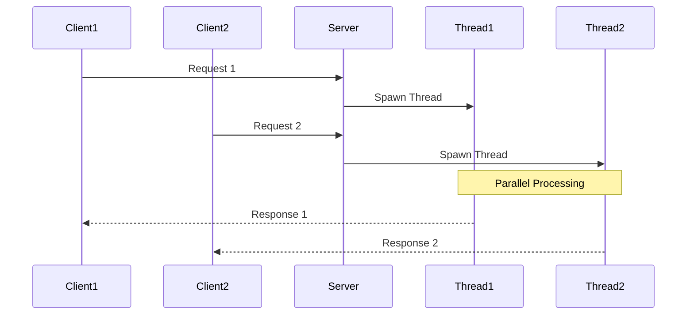
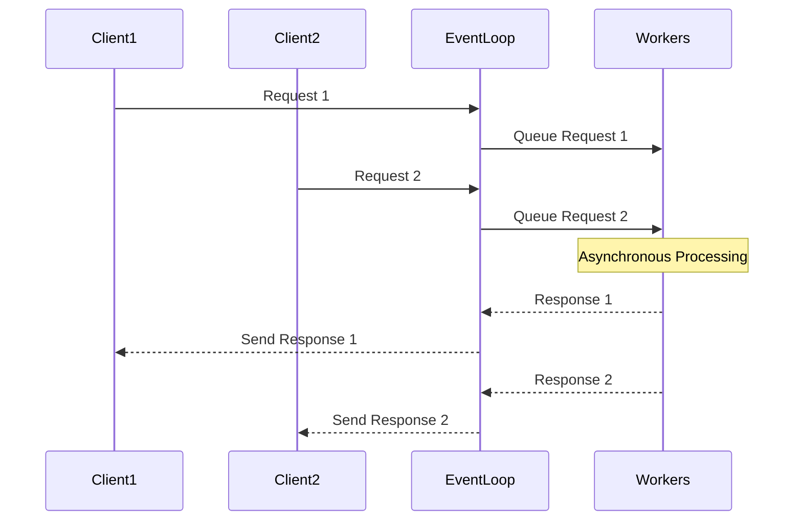

# Web Server Architecture Guide

## Core Architecture Models

### 1. Single-Threaded (Blocking) Architecture


**Characteristics:**
- One request processed at a time
- Simple to implement
- Predictable behavior
- Poor scalability
- Commonly used in development environments
- Example: Basic Python `http.server`

### 2. Multi-Threaded Architecture


**Characteristics:**
- Multiple requests handled simultaneously
- Each request gets its own thread
- Better resource utilization
- Memory overhead per thread
- Thread pool management required
- Example: Apache HTTP Server

### 3. Event-Driven (Non-Blocking) Architecture


**Characteristics:**
- Single thread handles multiple requests
- Non-blocking I/O operations
    - Instead of halting the entire program, non-blocking I/O utilizes asynchronous callbacks or promises to handle I/O operations in the background. This enables Node to handle multiple operations concurrently without being blocked, resulting in better performance and responsiveness
  
- Event loop manages requests
- Highly scalable
- Efficient resource usage
- Example: Node.js, Nginx

## Implementation Examples

### 1. Single-Threaded Server (Python)
```python
from http.server import HTTPServer, BaseHTTPRequestHandler

class SimpleHandler(BaseHTTPRequestHandler):
    def do_GET(self):
        # This will block until complete
        self.send_response(200)
        self.send_header('Content-type', 'text/plain')
        self.end_headers()
        self.wfile.write(b'Hello, World!')

server = HTTPServer(('localhost', 8000), SimpleHandler)
server.serve_forever()
```

### 2. Multi-Threaded Server (Java)
```java
public class ThreadedWebServer {
    public static void main(String[] args) {
        ExecutorService executor = Executors.newFixedThreadPool(10);
        
        ServerSocket server = new ServerSocket(8080);
        while (true) {
            Socket client = server.accept();
            executor.execute(() -> handleRequest(client));
        }
    }

    private static void handleRequest(Socket client) {
        // Handle request in separate thread
        // Process request and send response
    }
}
```

### 3. Event-Driven Server (Node.js)
```javascript
const http = require('http');

const server = http.createServer((req, res) => {
    // This is non-blocking
    if (req.url === '/api/data') {
        // Async database operation
        database.query('SELECT * FROM data', (err, results) => {
            res.writeHead(200, { 'Content-Type': 'application/json' });
            res.end(JSON.stringify(results));
        });
    } else {
        res.writeHead(404);
        res.end();
    }
});

server.listen(3000);
```

## Component Architecture

### 1. Request Processing Pipeline


### 2. Key Components

#### Connection Handler
- Manages TCP connections
- Handles connection pooling
- Implements timeout mechanisms
- Manages keep-alive connections

#### Request Parser
- Parses HTTP headers
- Handles different HTTP methods
- Processes query parameters
- Manages request body parsing

#### Router
- URL pattern matching
- Route parameters extraction
- Handler mapping
- HTTP method routing

#### Middleware
- Authentication
- Logging
- Request modification
- Response modification
- Error handling

#### Request Handler
- Business logic processing
- Data access
- External service calls
- Response generation

## Performance Considerations

### 1. Connection Management
- Keep-alive connections
- Connection pooling
- Connection timeouts
- Maximum connections limit

### 2. Resource Management
- Memory usage per connection
- CPU utilization
- File descriptor limits
- Thread pool sizing

### 3. Caching Strategies
- In-memory caching
- Response caching
- Static file caching
- Cache invalidation

## Configuration Example (Node.js with Express)
```javascript
const express = require('express');
const app = express();

// Connection management
app.set('keep-alive-timeout', 5000);
app.set('headers-timeout', 6000);

// Resource limits
app.use(express.json({ limit: '10mb' }));
app.use(express.urlencoded({ extended: true, limit: '10mb' }));

// Middleware
app.use(compression());
app.use(helmet());
app.use(morgan('combined'));

// Static files
app.use(express.static('public', {
    maxAge: '1d',
    etag: true
}));

// Error handling
app.use((err, req, res, next) => {
    console.error(err.stack);
    res.status(500).send('Something broke!');
});

app.listen(3000);
```

This architecture guide provides a foundation for understanding how web servers work and how to implement them effectively. The choice of architecture depends on your specific use case, expected load, and performance requirements.
