# Introduction to RabbitMQ

RabbitMQ is an open-source message broker written in Erlang that facilitates communication between different parts of a distributed system using the Advanced Message Queuing Protocol (AMQP). It acts as an intermediary layer, allowing producers (publishers) to send messages to consumers without requiring direct connections between them. This decoupling enhances system scalability, resilience, and maintainability.

In traditional architectures, every client might need to communicate directly with every other client, resulting in a complex and hard-to-maintain "spaghetti mesh." RabbitMQ solves this by providing a centralized message queue where messages can be published and consumed asynchronously, simplifying communication across the system.

---

## RabbitMQ Components

RabbitMQ consists of several key components that work together to enable efficient message passing. Below are the fundamental components:

- **Publisher**:  
  The entity that sends messages to RabbitMQ. Publishers do not need to know about the consumers; they simply publish messages to an exchange.

- **Consumer**:  
  The entity that receives messages from RabbitMQ. Consumers subscribe to queues and process messages as they arrive.

- **Connection**:  
  A TCP connection between the client (publisher or consumer) and the RabbitMQ server. Connections are resource-intensive to create, so they are typically kept open for multiple operations.

- **Channel**:  
  A virtual connection inside a TCP connection. Channels allow multiple lightweight connections over a single TCP connection, reducing overhead and improving efficiency.

- **Queue**:  
  A buffer that stores messages until they are consumed. Queues hold messages and can be consumed by one or more consumers based on configuration.

- **Exchange**:  
  Receives messages from publishers and routes them to queues based on routing keys and exchange types (e.g., direct, topic, fanout). Exchanges determine how messages are distributed to queues.

- **AMQP (Advanced Message Queuing Protocol)**:  
  The primary protocol used by RabbitMQ for messaging. It defines how messages are structured and how clients communicate with the server. RabbitMQ also supports other protocols, but AMQP is the most commonly used.

### Interaction Between Components

Here’s how the components interact:

```
[Publisher] --> [Exchange] --> [Queue] --> [Consumer]
```

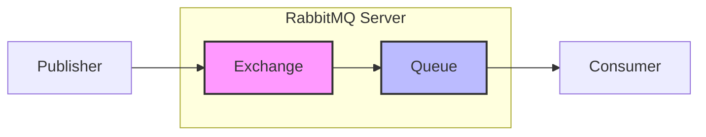

### Connection Architecture
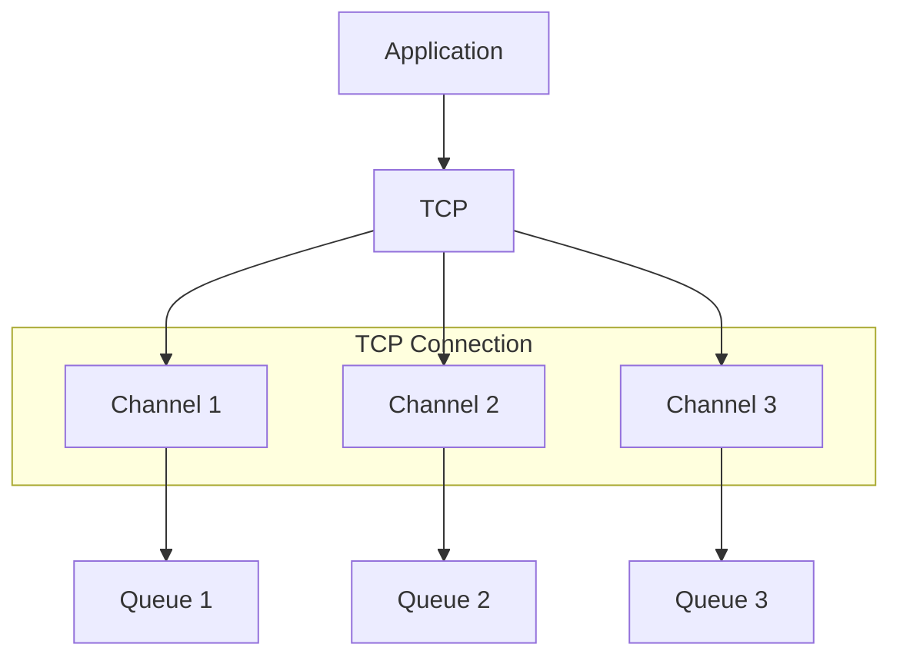

## Exchange Types & Patterns

### Direct Exchange
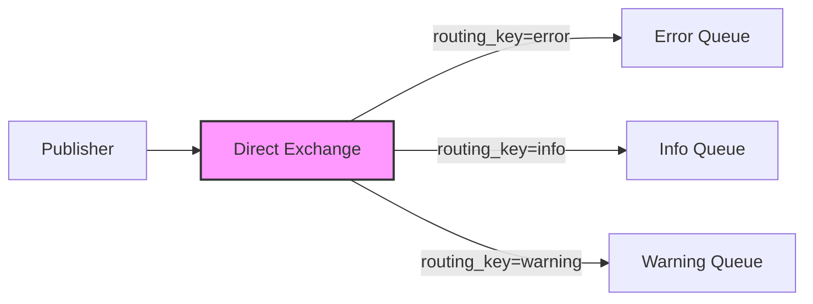

### Fanout Exchange
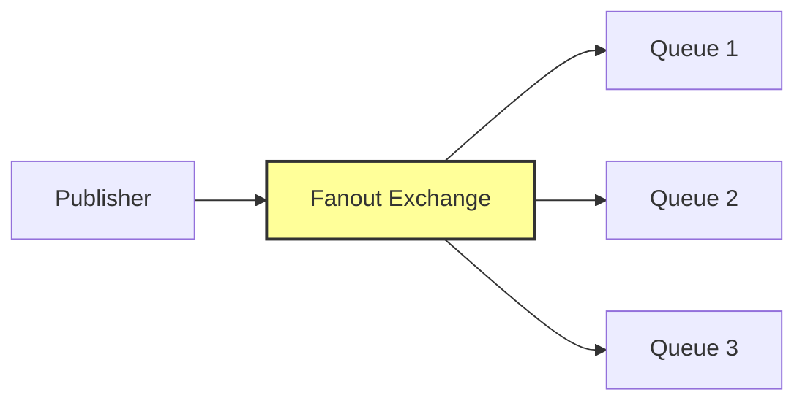

### Topic Exchange
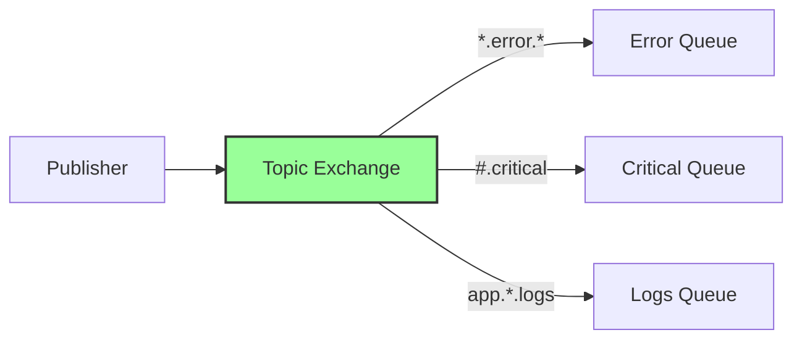

## Message Flow Patterns

### Basic Publish-Subscribe
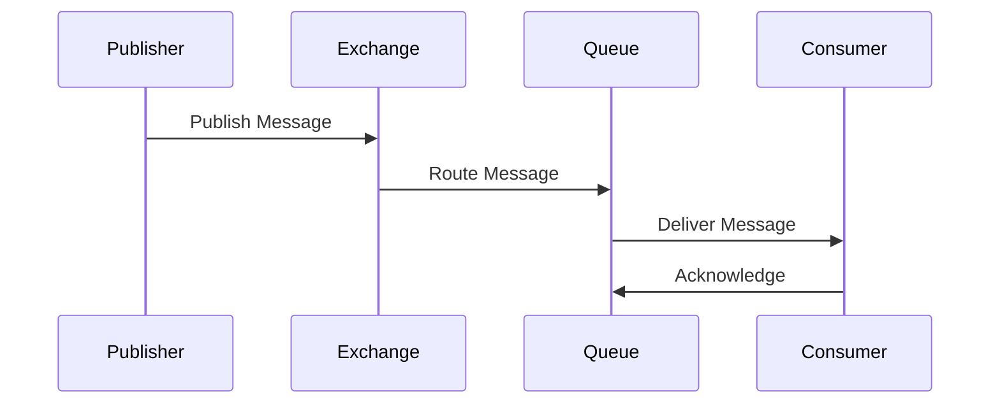

### Dead Letter Exchange Pattern
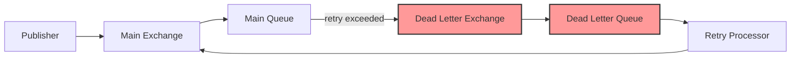

## Advanced Architectures

### Microservices Integration
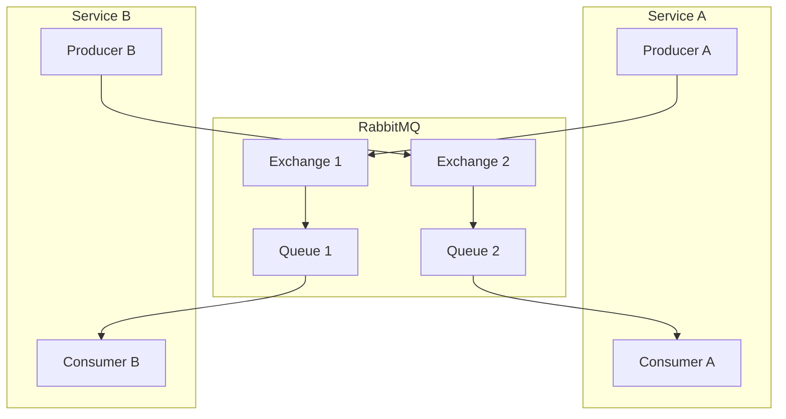

### High Availability Cluster
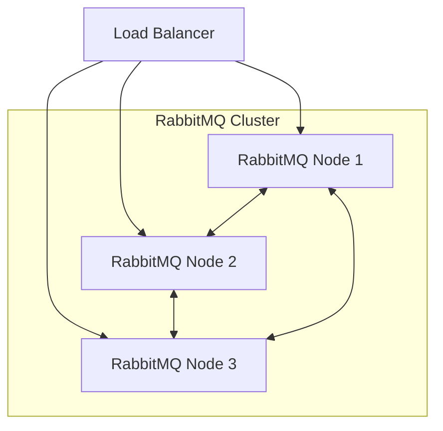

## Implementation Examples

### Basic Publisher Implementation
```javascript
const amqp = require('amqplib');

async function publishMessage() {
    const connection = await amqp.connect('amqp://localhost');
    const channel = await connection.createChannel();
    
    const exchange = 'main_exchange';
    const routingKey = 'example.key';
    const message = 'Hello World';
    
    await channel.assertExchange(exchange, 'direct', {durable: true});
    channel.publish(exchange, routingKey, Buffer.from(message));
}
```

### Reliable Consumer Implementation
```javascript
const amqp = require('amqplib');

async function consumeMessages() {
    const connection = await amqp.connect('amqp://localhost');
    const channel = await connection.createChannel();
    
    const queue = 'main_queue';
    await channel.assertQueue(queue, {durable: true});
    
    channel.prefetch(1);
    
    channel.consume(queue, async (msg) => {
        try {
            await processMessage(msg);
            channel.ack(msg);
        } catch (error) {
            channel.nack(msg, false, true);
        }
    });
}
```

## Production Architecture

### Complete System Architecture
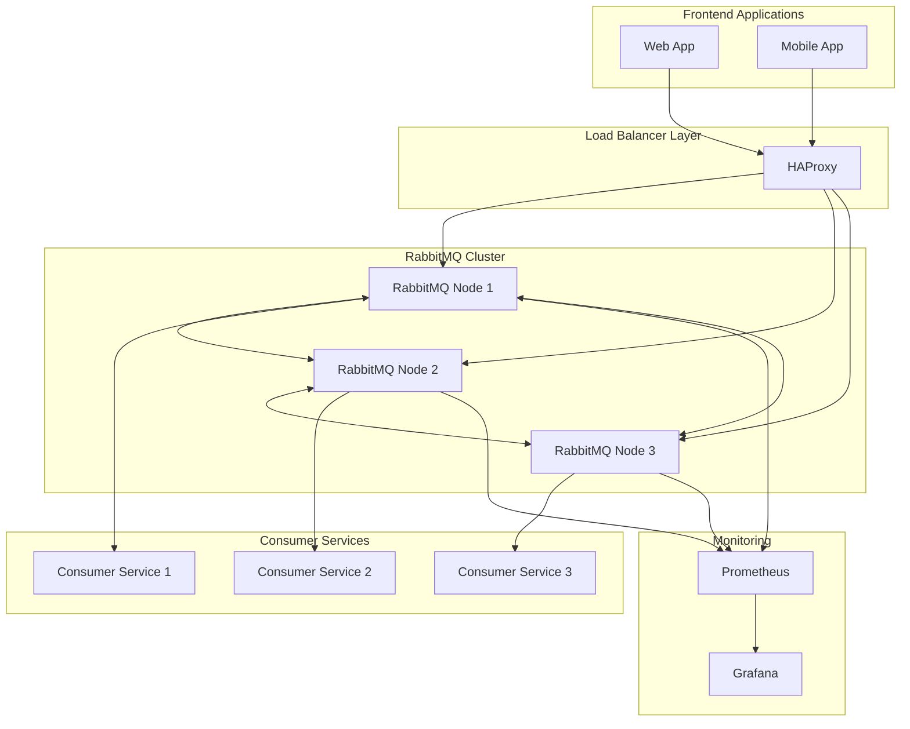

### Message Processing Flow
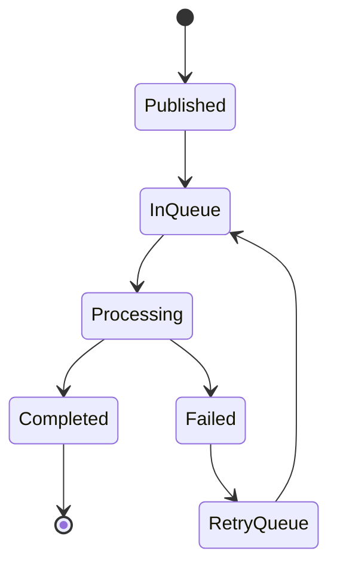

- The publisher sends a message to an exchange.
- The exchange routes the message to one or more queues based on the routing key and exchange type.
- Consumers retrieve messages from the queues and process them.

---

## Setting Up RabbitMQ with Docker

Docker provides a convenient way to quickly set up a RabbitMQ server without installing it directly on your machine. Follow these steps to spin up a RabbitMQ instance using Docker:

### Prerequisites
- Ensure Docker is installed on your machine.

### Steps

1. **Pull the RabbitMQ Docker Image**  
   Use the following command to pull the RabbitMQ image with the management plugin enabled:
   ```
   docker pull rabbitmq:3-management
   ```

2. **Run the RabbitMQ Container**  
   Run the following command to start a RabbitMQ container:
   ```
   docker run -d --name rabbitmq -p 5672:5672 -p 15672:15672 rabbitmq:3-management
   ```
   - `-d`: Runs the container in detached mode.
   - `--name rabbitmq`: Names the container for easy reference.
   - `-p 5672:5672`: Maps port 5672 for AMQP communication.
   - `-p 15672:15672`: Maps port 15672 for the RabbitMQ management UI.

3. **Access the RabbitMQ Management Interface**  
   Open your browser and navigate to `http://localhost:15672`. Log in using the default credentials:
   - Username: `guest`
   - Password: `guest`

The management interface allows you to monitor and manage queues, exchanges, and messages.

---

## Writing a Publisher Client in Node.js

To write a publisher client in Node.js, we’ll use the `amqplib` library to interact with RabbitMQ. Below is a step-by-step guide followed by a complete example.

### Prerequisites
- Node.js installed on your machine.
- RabbitMQ server running (e.g., via Docker as described above).

### Steps

1. **Install Dependencies**  
   Install `amqplib` using npm:
   ```
   npm install amqplib
   ```

2. **Write the Publisher Code**  
   Create a file named `publisher.js` and add the following code:

   ```javascript
   const amqp = require('amqplib');

   async function publishMessage() {
     try {
       // Establish a connection to RabbitMQ
       const connection = await amqp.connect('amqp://localhost');
       // Create a channel
       const channel = await connection.createChannel();
       // Define the queue name
       const queue = 'hello';

       // Assert the queue (create if it doesn't exist)
       await channel.assertQueue(queue, { durable: false });
       // Send a message to the queue
       channel.sendToQueue(queue, Buffer.from('Hello, World!'));

       console.log(" [x] Sent 'Hello, World!'");

       // Close the connection after a short delay
       setTimeout(() => {
         connection.close();
         process.exit(0);
       }, 500);
     } catch (error) {
       console.error(error);
     }
   }

   publishMessage();
   ```

3. **Run the Publisher**  
   Execute the script:
   ```
   node publisher.js
   ```
   You should see the message " [x] Sent 'Hello, World!'" in the console.

### Explanation
- The `amqp.connect` function establishes a connection to the RabbitMQ server.
- `createChannel` creates a channel for communication.
- `assertQueue` ensures the queue exists (creates it if it doesn’t).
- `sendToQueue` sends a message to the specified queue.

---

## Writing a Consumer Client in Node.js

Now, let’s write a consumer client to receive messages from the queue.

### Steps

1. **Write the Consumer Code**  
   Create a file named `consumer.js` and add the following code:

   ```javascript
   const amqp = require('amqplib');

   async function consumeMessage() {
     try {
       // Establish a connection to RabbitMQ
       const connection = await amqp.connect('amqp://localhost');
       // Create a channel
       const channel = await connection.createChannel();
       // Define the queue name
       const queue = 'hello';

       // Assert the queue (create if it doesn't exist)
       await channel.assertQueue(queue, { durable: false });
       console.log(" [*] Waiting for messages in %s. To exit press CTRL+C", queue);

       // Consume messages from the queue
       channel.consume(queue, (msg) => {
         console.log(" [x] Received %s", msg.content.toString());
       }, { noAck: true });
     } catch (error) {
       console.error(error);
     }
   }

   consumeMessage();
   ```

2. **Run the Consumer**  
   Open a new terminal and execute:
   ```
   node consumer.js
   ```
   The consumer will start and wait for messages. When you run the publisher, the consumer will log the received message.

### Explanation
- The consumer connects to RabbitMQ and creates a channel, similar to the publisher.
- `consume` subscribes to the queue and processes messages as they arrive.
- `{ noAck: true }` means the consumer does not send an acknowledgment to RabbitMQ (for simplicity). In production, you should enable acknowledgments (`noAck: false`) to ensure reliable message delivery.

---

## Real-Life Application Example

RabbitMQ is particularly useful for scheduling asynchronous jobs in distributed systems. Below is a common use case:

### Scenario: Asynchronous Job Processing
In a web application, you might need to perform time-consuming tasks such as:
- Sending emails
- Processing images
- Generating reports

Performing these tasks synchronously can block the main application thread, leading to poor performance. RabbitMQ allows you to offload these tasks to background workers.

### Architecture

```
[Web Application (Publisher)] --> [Exchange] --> [Queue] --> [Worker (Consumer)]
```

- **Publisher**:  
  The web application publishes messages (jobs) to a RabbitMQ queue whenever a task needs to be performed.

- **Consumer**:  
  A separate worker process consumes these messages and performs the tasks asynchronously.

### Benefits
- The web application remains responsive, as tasks are handled in the background.
- Workers can be scaled independently based on load.
- Failed tasks can be retried by re-publishing messages to the queue.

---

## My Thoughts on RabbitMQ

RabbitMQ is a powerful tool for building distributed systems, offering several advantages and some challenges.

### Advantages
- **Decoupling**:  
  RabbitMQ decouples producers and consumers, allowing them to operate independently. This simplifies system design and improves scalability.
- **Multiple Messaging Patterns**:  
  RabbitMQ supports various patterns, such as point-to-point (queues) and publish-subscribe (exchanges), making it versatile for different use cases.
- **Reliability**:  
  Features like message persistence, acknowledgments, and durable queues ensure reliable message delivery, even in the event of crashes.
- **Cross-Language Support**:  
  RabbitMQ supports multiple programming languages (e.g., Node.js, Python, Java) through client libraries.

### Challenges
- **Complexity**:  
  Setting up and managing RabbitMQ can be complex, especially in high-availability scenarios. Configuring exchanges, queues, and routing requires careful planning.
- **Monitoring and Maintenance**:  
  Monitoring message flows, handling failures, and managing retries can add overhead. The management UI helps, but it requires additional setup.
- **Resource Usage**:  
  RabbitMQ can be resource-intensive under high load, requiring optimization and tuning.

### When to Use RabbitMQ
RabbitMQ is ideal for:
- Asynchronous task processing (e.g., sending emails, generating reports).
- Event-driven architectures (e.g., microservices communication).
- Systems requiring reliable message delivery and persistence.

However, if your application has simple messaging needs, lighter alternatives like Redis or ZeroMQ might be more appropriate.

---

## Summary

In this README, we’ve covered the basics of RabbitMQ, including:
- Its components (publisher, consumer, connection, channel, queue, exchange, AMQP).
- How to set up RabbitMQ using Docker.
- How to write publisher and consumer clients in Node.js.
- A real-life application example demonstrating asynchronous job processing.
- Personal thoughts on the advantages and challenges of RabbitMQ.

RabbitMQ is a robust and versatile message broker that simplifies communication in distributed systems. While it has a learning curve, its features make it a valuable tool for many applications.

For further learning, explore the following resources:
- [Official RabbitMQ Documentation](https://www.rabbitmq.com/documentation.html)
- [Source Code Examples](https://github.com/hnasr/javascript_playground)
- [Docker Commands for RabbitMQ](https://github.com/hnasr/javascript_playground)

---

This README provides a comprehensive guide to understanding and using RabbitMQ. Ensure you have Node.js and Docker installed to follow the examples, and feel free to modify the code to suit your needs.
