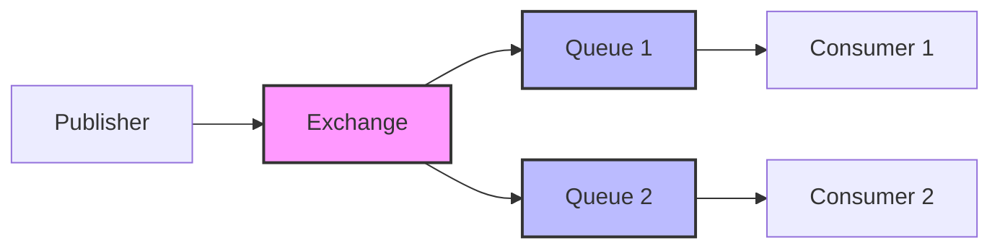
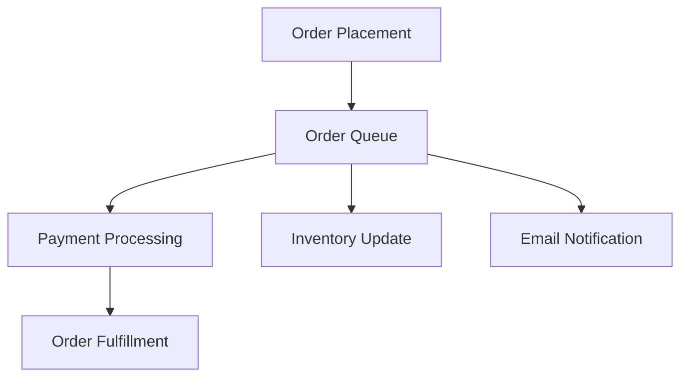

# RabbitMQ Integration Guide

## Table of Contents
- [Introduction](#introduction)
- [Core Concepts](#core-concepts)
- [Architecture](#architecture)
- [Real-World Applications](#real-world-applications)
- [Implementation Guide](#implementation-guide)
- [Best Practices](#best-practices)
- [Deployment](#deployment)
- [Monitoring](#monitoring)

## Introduction

RabbitMQ is a robust message broker that implements the Advanced Message Queuing Protocol (AMQP). It enables applications to communicate asynchronously, decouple processes, and scale efficiently by managing message queues between publishers and consumers.
**AMQP is a protocol for message-oriented middleware. AMQP enables the asynchronous transfer of messages regardless of hardware and programming language**

## Core Concepts

### Key Components
- **Exchange**: The routing mechanism that receives messages from publishers and routes them to queues
- **Queue**: Buffer that stores messages until consumers process them
- **Publisher**: Application that sends messages to an exchange
- **Consumer**: Application that processes messages from queues
- **Channel**: Virtual connection within an AMQP connection for handling communication
- **Connection**: TCP connection between the application and RabbitMQ broker

### Message Flow
```
Publisher -> Exchange -> Queue -> Consumer
```

## Architecture

### Basic Architecture


### Communication Protocols
- **AMQP**: Primary protocol for message queuing
- **HTTP**: Management API access (port 15672)

## Real-World Applications

### 1. E-commerce Order Processing


#### Implementation Example:
```javascript
// Order Publisher
const orderData = {
    orderId: "12345",
    items: [{id: "789", quantity: 2}],
    totalAmount: 99.99
};

await channel.assertExchange('order_exchange', 'direct');
await channel.publish('order_exchange', 'new_order', 
    Buffer.from(JSON.stringify(orderData)));

// Payment Consumer
channel.consume('payment_queue', async (msg) => {
    const order = JSON.parse(msg.content.toString());
    await processPayment(order);
    channel.ack(msg);
});
```

### 2. Real-time Analytics Pipeline
- Collect user events
- Process analytics in real-time
- Generate reports asynchronously

### 3. Microservices Communication
- Service-to-service messaging
- Event-driven architecture
- Distributed system coordination

## Implementation Guide

### 1. Basic Setup

```javascript
// Connection setup
const amqp = require("amqplib");
const connection = await amqp.connect("amqp://localhost:5672");
const channel = await connection.createChannel();
```

### 2. Publisher Implementation

```javascript
async function publishMessage(data) {
    try {
        await channel.assertQueue("my_queue");
        await channel.sendToQueue(
            "my_queue", 
            Buffer.from(JSON.stringify(data)),
            { persistent: true }
        );
    } catch (error) {
        console.error("Error publishing:", error);
    }
}
```

### 3. Consumer Implementation

```javascript
async function startConsumer() {
    try {
        await channel.assertQueue("my_queue");
        channel.prefetch(1);
        
        channel.consume("my_queue", async (message) => {
            const data = JSON.parse(message.content.toString());
            
            try {
                await processMessage(data);
                channel.ack(message);
            } catch (error) {
                channel.nack(message, false, true);
            }
        });
    } catch (error) {
        console.error("Consumer error:", error);
    }
}
```

## Best Practices

1. **Connection Management**
   - Reuse connections
   - Implement connection pooling
   - Handle reconnection scenarios

2. **Message Durability**
   ```javascript
   await channel.assertQueue("my_queue", { durable: true });
   await channel.sendToQueue("my_queue", Buffer.from(data), 
       { persistent: true });
   ```

3. **Error Handling**
   ```javascript
   channel.on('error', (error) => {
       console.error('Channel error:', error);
       // Implement recovery logic
   });
   ```

4. **Message Acknowledgment**
   - Use manual acknowledgment for critical messages
   - Implement dead letter queues for failed messages

## Deployment

### Docker Setup

```bash
# Basic RabbitMQ Server
docker run --name rabbitmq -p 5672:5672 -d rabbitmq

# RabbitMQ with Management Console
docker run --name rabbitmq \
    -p 5672:5672 \
    -p 15672:15672 \
    -d rabbitmq:3-management
```

### Management API Access

```javascript
// Example management API call
async function getQueueInfo() {
    const response = await fetch(
        "http://localhost:15672/api/queues",
        {
            headers: {
                "Authorization": `Basic ${btoa('guest:guest')}`
            }
        }
    );
    return await response.json();
}
```

## Monitoring

### Key Metrics to Monitor
1. Queue Length
2. Message Rate
3. Consumer Utilization
4. Connection Count
5. Channel Count

### Management UI Access
- URL: `http://localhost:15672`
- Default credentials: 
  - Username: guest
  - Password: guest

## Error Handling and Recovery

```javascript
// Implement circuit breaker
class MessageBroker {
    async connect() {
        try {
            this.connection = await amqp.connect(this.url);
            this.connection.on('error', this.handleConnectionError);
            this.channel = await this.connection.createChannel();
        } catch (error) {
            await this.reconnect();
        }
    }

    async reconnect() {
        await new Promise(resolve => setTimeout(resolve, 5000));
        await this.connect();
    }
}
```

This guide provides a comprehensive overview of RabbitMQ integration. For specific use cases or advanced configurations, refer to the official RabbitMQ documentation.
