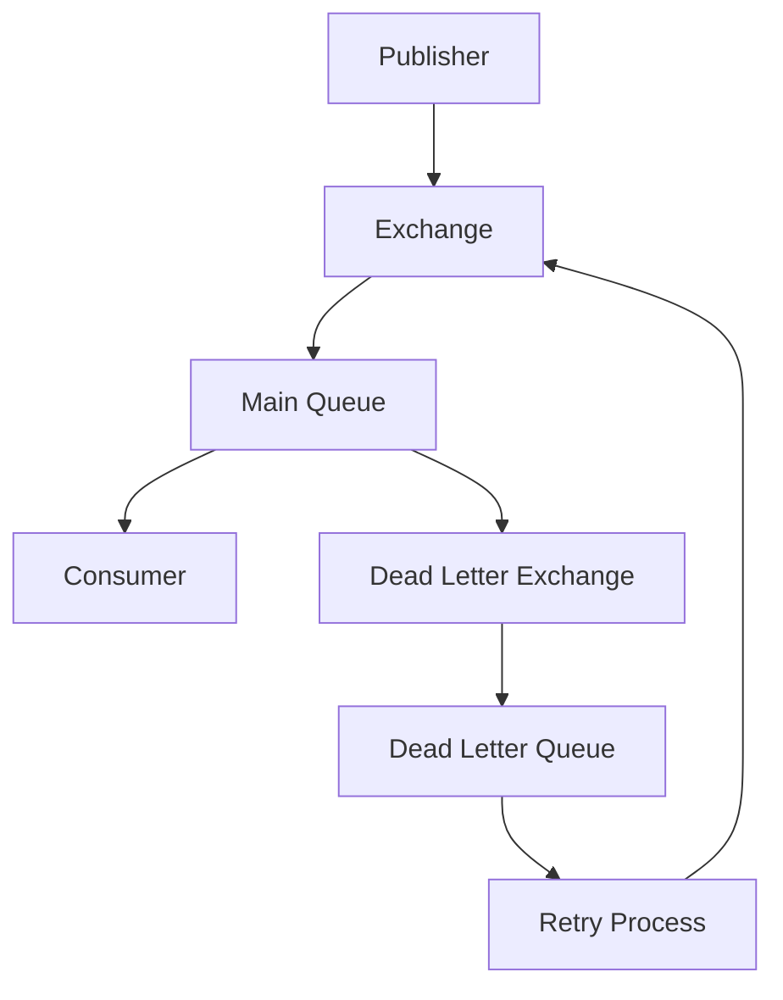
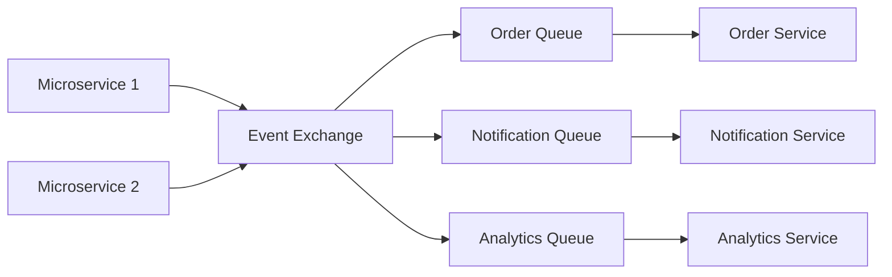

# Advanced RabbitMQ Integration Guide

## Table of Contents
- [Introduction](#introduction)
- [Advanced Architectural Patterns](#advanced-architectural-patterns)
- [Real-World Implementations](#real-world-implementations)
- [Scaling Strategies](#scaling-strategies)
- [Production Best Practices](#production-best-practices)
- [Security Considerations](#security-considerations)
- [Performance Optimization](#performance-optimization)
- [Troubleshooting Guide](#troubleshooting-guide)

## Introduction

RabbitMQ is an enterprise-grade message broker supporting multiple messaging protocols, with AMQP as its primary protocol. This guide covers advanced implementation patterns and production-ready configurations.

## Advanced Architectural Patterns

### 1. Publisher-Subscriber Pattern with Dead Letter Exchange


#### Implementation:
```javascript
// Dead Letter Exchange Setup
async function setupDLX() {
    const channel = await connection.createChannel();
    
    // Create Dead Letter Exchange
    await channel.assertExchange('dlx', 'direct');
    
    // Create Main Queue with DLX
    await channel.assertQueue('main_queue', {
        deadLetterExchange: 'dlx',
        deadLetterRoutingKey: 'failed',
        messageTtl: 60000 // Messages move to DLX after 60s
    });

    // Create Dead Letter Queue
    await channel.assertQueue('dead_letter_queue');
    await channel.bindQueue('dead_letter_queue', 'dlx', 'failed');
    
    return channel;
}
```

### 2. Event-Driven Microservices Architecture


## Real-World Implementations

### 1. High-Frequency Trading System
```javascript
// High-Priority Queue Setup
async function setupTradingSystem() {
    const channel = await connection.createChannel();
    
    await channel.assertQueue('trading_queue', {
        maxPriority: 10,
        messageTtl: 1000, // 1 second TTL for trade orders
        durable: true
    });

    // Priority Publisher
    async function publishTrade(tradeData, priority) {
        await channel.sendToQueue('trading_queue', 
            Buffer.from(JSON.stringify(tradeData)),
            {
                priority: priority,
                persistent: true,
                timestamp: Date.now()
            }
        );
    }

    // High-Speed Consumer
    channel.consume('trading_queue', async (msg) => {
        const trade = JSON.parse(msg.content.toString());
        if (Date.now() - msg.properties.timestamp < 1000) {
            await processTrade(trade);
            channel.ack(msg);
        } else {
            // Trade expired
            channel.reject(msg, false);
        }
    }, { noAck: false });
}
```

### 2. E-commerce Order Processing Pipeline
```javascript
class OrderProcessor {
    async setupOrderPipeline() {
        const channel = await connection.createChannel();
        
        // Fanout exchange for order processing
        await channel.assertExchange('orders', 'fanout');
        
        // Multiple queues for different aspects of order processing
        const queues = [
            'order.validation',
            'order.payment',
            'order.inventory',
            'order.shipping',
            'order.notification'
        ];

        for (const queue of queues) {
            await channel.assertQueue(queue);
            await channel.bindQueue(queue, 'orders', '');
        }

        return channel;
    }

    async processOrder(orderData) {
        const steps = {
            validation: async () => this.validateOrder(orderData),
            payment: async () => this.processPayment(orderData),
            inventory: async () => this.updateInventory(orderData),
            shipping: async () => this.arrangeShipping(orderData),
            notification: async () => this.sendNotifications(orderData)
        };

        for (const [step, processor] of Object.entries(steps)) {
            try {
                await processor();
                await this.channel.publish('orders', '', 
                    Buffer.from(JSON.stringify({ step, status: 'completed' })));
            } catch (error) {
                await this.handleProcessingError(step, error);
            }
        }
    }
}
```

## Scaling Strategies

### 1. Cluster Configuration
```javascript
// Cluster Connection Setup
const servers = [
    'amqp://rabbit1:5672',
    'amqp://rabbit2:5672',
    'amqp://rabbit3:5672'
];

class ClusterConnection {
    constructor(servers) {
        this.servers = servers;
        this.currentIndex = 0;
    }

    async connect() {
        while (true) {
            try {
                const connection = await amqp.connect(
                    this.servers[this.currentIndex]
                );
                console.log(`Connected to ${this.servers[this.currentIndex]}`);
                return connection;
            } catch (error) {
                this.currentIndex = (this.currentIndex + 1) % this.servers.length;
                await new Promise(resolve => setTimeout(resolve, 1000));
            }
        }
    }
}
```

### 2. Load Balancing Consumer
```javascript
class LoadBalancedConsumer {
    constructor(channel, queueName, processFunction) {
        this.channel = channel;
        this.queueName = queueName;
        this.processFunction = processFunction;
    }

    async start(concurrency = 3) {
        await this.channel.prefetch(concurrency);
        
        for (let i = 0; i < concurrency; i++) {
            this.channel.consume(this.queueName, async (msg) => {
                try {
                    await this.processFunction(msg);
                    this.channel.ack(msg);
                } catch (error) {
                    this.handleError(msg, error);
                }
            });
        }
    }

    handleError(msg, error) {
        if (msg.properties.headers['x-retry-count'] < 3) {
            // Retry with backoff
            const retryCount = (msg.properties.headers['x-retry-count'] || 0) + 1;
            const delay = Math.pow(2, retryCount) * 1000;
            
            setTimeout(() => {
                this.channel.sendToQueue(this.queueName, msg.content, {
                    headers: { 'x-retry-count': retryCount }
                });
            }, delay);
            
            this.channel.ack(msg);
        } else {
            // Move to DLQ after max retries
            this.channel.reject(msg, false);
        }
    }
}
```

## Production Best Practices

### 1. Connection Management
```javascript
class RobustConnection {
    constructor(config) {
        this.config = config;
        this.connection = null;
        this.channel = null;
        this.reconnectTimeout = 5000;
    }

    async connect() {
        try {
            this.connection = await amqp.connect(this.config.url);
            
            this.connection.on('error', (error) => {
                console.error('Connection error:', error);
                this.reconnect();
            });

            this.connection.on('close', () => {
                console.error('Connection closed unexpectedly');
                this.reconnect();
            });

            this.channel = await this.connection.createChannel();
            await this.setupChannelMiddleware();
            
            return this.channel;
        } catch (error) {
            console.error('Failed to connect:', error);
            await new Promise(resolve => 
                setTimeout(resolve, this.reconnectTimeout)
            );
            return this.connect();
        }
    }

    async setupChannelMiddleware() {
        // Implement channel-level middleware
        this.channel.use(async (msg, next) => {
            const startTime = Date.now();
            await next();
            const duration = Date.now() - startTime;
            console.log(`Message processed in ${duration}ms`);
        });
    }
}
```

### 2. Message Persistence and Acknowledgment
```javascript
class ReliablePublisher {
    async publish(exchange, routingKey, content, options = {}) {
        const defaultOptions = {
            persistent: true,
            mandatory: true,
            headers: {
                'message-id': uuid(),
                'timestamp': Date.now()
            }
        };

        const publishOptions = { ...defaultOptions, ...options };
        
        // Confirm channel setup
        await this.channel.confirmSelect();

        return new Promise((resolve, reject) => {
            this.channel.publish(
                exchange,
                routingKey,
                Buffer.from(JSON.stringify(content)),
                publishOptions,
                (err, ok) => {
                    if (err) reject(err);
                    else resolve(ok);
                }
            );
        });
    }
}
```

## Security Considerations

### 1. SSL/TLS Configuration
```javascript
const sslConnection = async () => {
    const opts = {
        cert: fs.readFileSync('./client/cert.pem'),
        key: fs.readFileSync('./client/key.pem'),
        passphrase: 'secure-passphrase',
        ca: [fs.readFileSync('./ca/cert.pem')],
        verify: true
    };

    return await amqp.connect({
        protocol: 'amqps',
        hostname: 'rabbit.example.com',
        port: 5671,
        ...opts
    });
};
```

### 2. Authentication and Authorization
```javascript
// RBAC Implementation
const vhostPermissions = {
    configure: '^(amq\\.gen.*|amq\\.default)$',
    write: '^(amq\\.gen.*|amq\\.default)$',
    read: '^(amq\\.gen.*|amq\\.default)$'
};

async function setupUserPermissions(channel) {
    await channel.assertExchange('restricted_exchange', 'direct', { 
        durable: true,
        internal: true 
    });
    
    await channel.assertQueue('restricted_queue', {
        exclusive: true,
        autoDelete: true
    });
}
```

## Performance Optimization

### 1. Batch Processing
```javascript
class BatchProcessor {
    constructor(batchSize = 100, flushInterval = 5000) {
        this.batch = [];
        this.batchSize = batchSize;
        this.flushInterval = flushInterval;
        this.timer = null;
    }

    async add(message) {
        this.batch.push(message);
        
        if (this.batch.length >= this.batchSize) {
            await this.flush();
        } else if (!this.timer) {
            this.timer = setTimeout(() => this.flush(), this.flushInterval);
        }
    }

    async flush() {
        if (this.batch.length === 0) return;
        
        const messages = this.batch;
        this.batch = [];
        clearTimeout(this.timer);
        this.timer = null;

        await this.processBatch(messages);
    }

    async processBatch(messages) {
        // Implement batch processing logic
        await Promise.all(messages.map(msg => this.processMessage(msg)));
    }
}
```

### 2. Consumer Rate Limiting
```javascript
class RateLimitedConsumer {
    constructor(channel, queue, rateLimit) {
        this.channel = channel;
        this.queue = queue;
        this.rateLimit = rateLimit;
        this.tokenBucket = rateLimit;
        this.lastRefill = Date.now();
    }

    async consume(processor) {
        await this.channel.prefetch(1);
        
        this.channel.consume(this.queue, async (msg) => {
            if (this.checkRateLimit()) {
                try {
                    await processor(msg);
                    this.channel.ack(msg);
                } catch (error) {
                    this.channel.nack(msg);
                }
            } else {
                // Requeue message if rate limit exceeded
                this.channel.nack(msg, false, true);
                await new Promise(resolve => 
                    setTimeout(resolve, 1000)
                );
            }
        });
    }

    checkRateLimit() {
        const now = Date.now();
        const timePassed = now - this.lastRefill;
        this.tokenBucket += Math.floor(timePassed * (this.rateLimit / 1000));
        this.tokenBucket = Math.min(this.tokenBucket, this.rateLimit);
        this.lastRefill = now;

        if (this.tokenBucket >= 1) {
            this.tokenBucket -= 1;
            return true;
        }
        return false;
    }
}
```

## Troubleshooting Guide

### Common Issues and Solutions

1. **Connection Issues**
```javascript
class ConnectionDiagnostics {
    async checkConnection() {
        try {
            const connection = await amqp.connect(this.url);
            const channel = await connection.createChannel();
            
            // Check connection status
            console.log('Connection Status:', {
                connection: connection.connection.state,
                channel: channel.channel.state,
                serverProperties: connection.connection.serverProperties
            });
            
            return true;
        } catch (error) {
            console.error('Connection Check Failed:', {
                error: error.message,
                code: error.code,
                stackTrace: error.stack
            });
            return false;
        }
    }
}
```

2. **Queue Health Check**
```javascript
async function queueHealthCheck(channel, queue) {
    try {
        const { messageCount, consumerCount } = 
            await channel.assertQueue(queue, { passive: true });
        
        const status = {
            queue,
            messageCount,
            consumerCount,
            status: messageCount < 1000 && consumerCount > 0 ? 'healthy' : 'warning'
        };
        
        console.log('Queue Health:', status);
        return status;
    } catch (error) {
        console.error('Queue Health Check Failed:', error);
        throw error;
    }
}
```

This enhanced guide provides production-ready patterns and implementations for building robust, scalable message-processing systems with RabbitMQ. Each section includes practical code examples that can be adapted to specific use cases.

Remember to adjust configurations and implementations based on your specific requirements and load patterns.


### Summary:
**1.Advanced Architectural Patterns**

Dead Letter Exchange implementation
Event-driven microservices architecture
Priority queuing systems


**2.Real-World Implementations**

High-frequency trading system
Complete e-commerce order processing pipeline
Batch processing systems


**3.Production-Ready Features**

Robust connection management
Clustering and high availability
Security implementations
Performance optimization techniques
Comprehensive error handling


**4.Troubleshooting**

Diagnostic tools
Health checks
Common issues and solutions